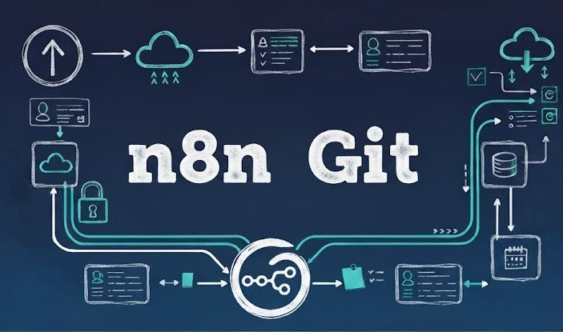

<!-- markdownlint-disable MD033 -->
<h1 align="center"><b>n8n-git</b></h1>
<p align="center"><em>Sync, backup, import and organise n8n workflows and folders.</em></p>

<p align="center">
  <a href="#-installation">Installation</a> ·
  <a href="#-getting-started">Getting Started</a> ·
  <a href="#%EF%B8%8F-configuration">Configuration</a> ·
  <a href="#-features">Features</a> ·
  <a href="#-contributing">Contributing</a> ·
  <a href="#-troubleshooting">Troubleshooting</a>
</p>

<p align="center">
  
</p>

<!-- ALL_BADGES_START -->
<p align="center">
  <a href="https://github.com/tcoretech/n8n-git/releases/latest"></a>
  <a href="LICENSE"></a>
  <a href="https://github.com/tcoretech/n8n-git/stargazers"></a>
  <a href="https://github.com/tcoretech/n8n-git/network/members"></a>
  <a href="https://github.com/tcoretech/n8n-git/graphs/contributors"></a>
  <a href="https://github.com/tcoretech/n8n-git/commits/main"></a>
  <a href="https://github.com/tcoretech/n8n-git"></a>
  <a href="https://github.com/tcoretech/n8n-git"></a>
</p>
<!-- ALL_BADGES_END -->

## ♾️ Overview

Keep workflows, credentials, and folders in sync with GitHub or a local file system for quick import, backup, versioning, and fast organisation. The CLI wraps n8n's REST API to enable folder management so you can maintain consistent organisation between environments.

| Command | Action |
| --- | --- |
| **Push** | Exports workflows, credentials, and/or environment variables from the n8n instance, maintains folder structure, and pushes to Git or a local folder. |
| **Pull** | Pulls workflows from a local path or Git repo and imports them into n8n, preserving repository structure. |
| **Reset** | Replays repository history into your n8n workspace (by commit/tag/time window) to restore, archive, or remove workflows with interactive or scripted flows. |

## 📦 Installation

### Prerequisites

n8n-git supports multiple execution environments:

1. **Docker Execution** (Default):
   - Self-hosted n8n instance running in Docker
   - Docker installed and accessible on your host machine

2. **Local Execution**:
   - n8n installed locally (npm/pnpm)
   - `n8n` command available in PATH

3. **Embedded Execution**:
   - n8n-git installed inside your n8n container
   - Useful for triggering git operations from n8n workflows

**Common Requirements:**

- Host system with `bash` 4+, `git`, `curl`, and `jq`
- GitHub account (for remote Git storage) or local filesystem access

> **Note**: n8n-git is designed for self-hosted n8n instances running in Docker containers. It does not currently support n8n Cloud.

### One-liner (Recommended)

```bash
curl -sSL https://raw.githubusercontent.com/tcoretech/n8n-git/main/install.sh | sudo bash
```

This installs `n8n-git` to `/usr/local/bin` and libraries to `/usr/local/share/n8n-git/lib`. Customize with environment variables:

```bash
PREFIX="$HOME/.local" curl -sSL https://raw.githubusercontent.com/tcoretech/n8n-git/main/install.sh | bash
```

### Clone and Install

```bash
git clone https://github.com/tcoretech/n8n-git.git
cd n8n-git
make install  # Defaults to /usr/local; override with PREFIX=/custom/path
```

Verify installation: `n8n-git --help`

---

## 🚀 Getting Started

### Quick Start

Configuration follows this **precedence chain**:

1. **CLI arguments** (highest priority)
2. **Local `.config`** (project directory)  
3. **User config** (`~/.config/n8n-git/config`)
4. **Interactive prompts** (if no value found)
5. **Defaults** (built-in fallbacks)

### 1. Configure n8n-git

Run the interactive config wizard:

```bash
n8n-git config
```

This creates `~/.config/n8n-git/config` with your settings.

### 2. Set Up n8n Session Authentication

**Important**: Folder structure sync requires n8n REST API authentication. The n8n API does not yet expose folder management via API keys, so **session-based authentication** is currently required.

Create a **Basic Auth credential** in n8n:

1. In n8n UI: **Credentials** → **Add Credential** → **Basic Auth**
2. Enter your n8n **login email** and **password**
3. Name it `N8N REST BACKUP` (or your preferred name)
4. Add to your config file:

   ```bash
   N8N_LOGIN_CREDENTIAL_NAME="N8N REST BACKUP"
   N8N_BASE_URL="http://localhost:5678"
   FOLDER_STRUCTURE=true
   ```

> **Note on API Keys**: While `N8N_API_KEY` is supported in the config, it's currently a **placeholder** awaiting n8n API support for folder operations. Session authentication is the working method.
> **Folder structure is optional**: Without it, workflows are stored flat by ID/name. Enable it to preserve `Project/Folder/Workflow.json` hierarchy in Git.

### 3. Try Common Operations

**Backup workflows to GitHub** (with folder structure):

```bash
n8n-git push --repo <username>/n8n-backup --github-path backup-folder/
```

**Pull workflows from a public repository** into a specific n8n path:

```bash
n8n-git pull \
  --repo Zie619/n8n-workflows \
  --github-path workflows/Gmail \
  --n8n-path Examples/Gmail
```

**Explore interactive reset** (time travel through Git history):

```bash
n8n-git reset --interactive
```

This lets you browse commits and restore your workspace to any point. Use `--mode soft` to archive workflows or `--mode hard` to delete them permanently.

**Undo the pull** (reset back to before):

```bash
n8n-git reset --interactive --mode soft
# Select the commit before your pull operation
```

---

## ⚙️ Configuration

### User Configuration

For your default settings, use the interactive wizard:

```bash
n8n-git config  # Creates/updates ~/.config/n8n-git/config
```

This sets up your user-wide configuration at `~/.config/n8n-git/config`.

### Project-Specific Configuration

For different use cases (production backup, client sync, development testing), create project-specific configs:

```bash
# Example: Production daily backup
mkdir -p ~/projects/n8n-production-backup
cp .config.example ~/projects/n8n-production-backup/.config
cd ~/projects/n8n-production-backup

# Edit for your use case:
cat > .config <<EOF
GITHUB_REPO="mycompany/n8n-prod-backup"
GITHUB_BRANCH="main"
WORKFLOWS=2          # Remote Git storage
CREDENTIALS=1        # Local encrypted storage
FOLDER_STRUCTURE=true
N8N_CONTAINER="n8n-prod"
EOF

# Run from this directory - uses local .config
n8n-git push
```

### Configuration Reference

| Config Variable | CLI Flag | Description | Values |
| --------------- | ----------- | ------------- | --------- |
| **Github options** | | | |
| `GITHUB_REPO` | `--repo <user/repo>` | Git repository | `myuser/n8n-backups` |
| `GITHUB_TOKEN` | `--token <pat>` | GitHub Personal Access Token | `ghp_...` |
| `GITHUB_BRANCH` | `--branch <name>` | Git branch | `main` (default) |
| `GITHUB_PATH` | `--github-path <path>` | Repo subdirectory (supports `%DATE%`, `%PROJECT%`, `%PERSONAL_PROJECT%`, `%HOSTNAME%`) | `backups/%DATE%/` |
| **n8n Instance Options** | | | |
| `N8N_CONTAINER` | `--container <id\|name>` | Docker container | `n8n` (default) |
| `N8N_BASE_URL` | `--n8n-url <url>` | n8n base URL | `http://localhost:5678` |
| `N8N_API_KEY` | `--n8n-api-key <key>` | n8n API key (placeholder) | `n8n_api_...` |
| `N8N_LOGIN_CREDENTIAL_NAME` | `--n8n-cred <name>` | Session auth credential | `N8N REST BACKUP` |
| `N8N_EMAIL` | `--n8n-email <email>` | Direct session email | Not recommended |
| `N8N_PASSWORD` | `--n8n-password <pass>` | Direct session password | Not recommended |
| `N8N_PROJECT` | `--project <project>` | n8n Project | `%PERSONAL_PROJECT%` (default) |
| `N8N_PATH` | `--n8n-path <path>` | Path within n8n project | `clients/acme` |
| **Storage Mode Options** | | | |
| `WORKFLOWS` | `--workflows <mode>` | Workflow handling | `0`=skip, `1`=local, `2`=Git |
| `CREDENTIALS` | `--credentials <mode>` | Credential handling | `0`=skip, `1`=local, `2`=Git |
| `ENVIRONMENT` | `--environment <mode>` | Environment variable handling | `0`=skip, `1`=local, `2`=Git |
| `LOCAL_BACKUP_PATH` | `--local-path <path>` | Local storage directory | `~/n8n-backup` |
| `DECRYPT_CREDENTIALS` | `--decrypt <true\|false>` | Export decrypted credentials | `false` (default) |
| **Folder Structure Options** | | | |
| `FOLDER_STRUCTURE` | `--folder-structure` | Sync n8n folder hierarchy | `true`/`false` |
| **General Options** | | | |
| `DRY_RUN` | `--dry-run` | Simulate without changes | Flag / `true`/`false` |
| `ASSUME-DEFAULTS` | `--defaults` | Non-interactive mode | Flag / `true`/`false` |
| `VERBOSE` | `--verbose` | Verbose logging | Flag / `true`/`false` |
| `LOG_FILE` | `--log-file <path>` | Log to file | Path |
| N/A | `--config <path>` | Custom config file | Path |

**Full reference**: See [.config.example](.config.example) for all options with inline documentation.

**Security Best Practice**: Never set `CREDENTIALS=2` (remote Git) and `DECRYPT_CREDENTIALS=true` at the same time — this would commit plaintext secrets to Git!

---

## 🚀 Features

### Push — Export & Backup

Export workflows, credentials, and environment variables from n8n to Git or local storage.

**Examples**:

**Git backup with folder structure** — Ideal for version control and team collaboration. Workflows are pushed to Git while sensitive credentials remain local and encrypted.

```bash
n8n-git push \
  --container n8n \
  --workflows 2 \
  --credentials 2 \
  --folder-structure \
  --n8n-url "http://localhost:5678"
```

**Local-only backup** — Best for air-gapped environments or when you want full control over storage. All data stays on your local machine without touching remote repositories.

```bash
n8n-git push \
  --container n8n \
  --workflows local \
  --credentials local \
  --environment local
```

**Automated daily backup via cron** — Perfect for scheduled production backups. Runs automatically at 2 AM daily with dated folders for easy restoration. Use `--defaults` for non-interactive execution.

```bash
# /etc/cron.d/n8n-backup
0 2 * * * user /usr/local/bin/n8n-git push \
  --workflows 2 \
  --credentials 1 \
  --folder-structure \
  --github-path "daily-backup/%DATE%/" \
  --defaults
```

**Key Flags**:

- `--workflows 0|1|2` — Skip, local, or Git storage
- `--credentials 0|1|2` — Credential handling mode
- `--environment 0|1|2` — Environment variable handling
- `--folder-structure` — Preserve n8n folder hierarchy
- `--decrypt true|false` — Export plaintext credentials (dangerous!)
- `--github-path <prefix>` — Set Git subdirectory (supports `%DATE%`, `%PROJECT%`)
- `--dry-run` — Preview without making changes
- `--defaults` — Skip prompts (for automation)

### Pull — Import & Restore

Import workflows from Git or local storage into n8n. Optionally recreate folder structure.

**Examples**:

**Restore from Git with folder structure** — Ideal for disaster recovery or cloning n8n instances. Recreates the complete project and folder hierarchy from your backup repository.

```bash
n8n-git pull \
  --container n8n \
  --repo "user/n8n-backup" \
  --folder-structure \
  --n8n-url "http://localhost:5678" \
  --defaults
```

**Import from local backup** — Best for offline restores or when working without Git. Imports workflows and credentials from local filesystem storage without folder sync.

```bash
n8n-git pull \
  --container n8n \
  --workflows local \
  --credentials local
```

**Selective restore with ID preservation** — Perfect for importing specific workflows without duplicates. Restores only workflows while preserving their original IDs to avoid conflicts with existing workflows.

```bash
n8n-git pull \
  --repo "user/n8n-backup" \
  --workflows 2 \
  --credentials 0 \
  --preserve \
  --defaults
```

**Key Flags**:

- `--workflows 0|1|2` — Source: skip, local, or Git
- `--credentials 0|1|2` — Import credentials
- `--folder-structure` — Recreate n8n folders from Git structure
- `--preserve` — Keep original workflow IDs (avoid duplicates)
- `--no-overwrite` — Assign new IDs to prevent conflicts
- `--defaults` — Use config defaults, skip prompts

**Pull Pipeline**:

1. **Staging** — Generate manifest of workflows from Git/local
2. **Folder State** — Load n8n project/folder hierarchy
3. **Folder Sync** — Create missing folders recursively
4. **Folder Assignment** — Map workflows to correct folders
5. **Validation** — Verify import success, report metrics

### Reset — Time Travel & Recovery

Replay Git history into n8n to restore, archive, or delete workflows based on commits, tags, or time windows.

**Examples**:

**Reset to specific commit** — Useful for undoing recent changes or reverting to a known good state. Soft mode archives workflows that don't exist in the target commit.

```bash
n8n-git reset --to abc123f --mode soft
```

**Interactive commit browser** — Best for exploring history visually. Browse commits with filters and toggle between day/week view to find the exact state you want.

```bash
n8n-git reset --interactive --mode soft
```

**Time-window recovery** — Perfect for recovering workflows from a specific date range. Restores all workflows that existed during the specified time period.

```bash
n8n-git reset \
  --since "2025-11-01 09:00" \
  --until "2025-11-04 23:59" \
  --mode soft
```

**Hard reset to tag** — Use with caution for permanent cleanup. Permanently deletes workflows not present in the target commit (after archiving them first).

```bash
n8n-git reset --to v2.0.0 --mode hard  # Use with caution!
```

**Preview impact without changes** — Always preview first to understand what will change. Shows which workflows would be archived or deleted without actually performing the operation.

```bash
n8n-git reset --to main --dry-run
```

**Key Flags**:

- `--to <sha|tag>` — Target commit/tag/branch
- `--since <time>` / `--until <time>` — Time window (natural language supported)
- `--interactive` — Visual commit picker with filters
- `--mode soft|hard` — Soft=archive, Hard=delete
- `--dry-run` — Preview plan without execution

**Reset Modes**:

| Mode | Behavior | API Calls |
| ------ | ---------- | ----------- |
| `soft` | Archive workflows missing from target | `POST /rest/workflows/{id}/archive` |
| `hard` | Delete workflows not in target (after archive) | Archive + `DELETE /rest/workflows/{id}` |

**Full documentation**: [docs/reset.md](docs/reset.md)

### Additional Capabilities

- **Storage Modes**:
  - `0`/`disabled` — Skip component
  - `1`/`local` — Store in `~/n8n-backup` (encrypted, air-gapped)
  - `2`/`remote` — Push to Git repository
  
- **Sparse Checkout** — Efficient Git operations with `--github-path` (only fetch relevant subdirectory)

- **Per-Workflow Commits** — Individual commits per workflow with `[new]`/`[updated]`/`[deleted]` messages

- **JSON Prettification** — Automatic formatting (2-space indent, sorted keys) for readable diffs

- **Permission Enforcement** — Local credentials stored with `600` permissions (user-only access)

- **Alpine & Debian Support** — Compatible with both n8n container base images

- **Dry-Run Mode** — Preview all operations without side effects (`--dry-run`)

- **Verbose Logging** — Detailed output for debugging (`--verbose`)

---

## 😁 Support / Buy Me a Coffee

If `n8n-git` saves you time or helps you in your workflows,
you can say thanks and support further development here:

[](https://buymeacoffee.com/tcoretech)

## 🤝 Contributing

### Development Workflow

1. **Clone and setup**:

   ```bash
   git clone https://github.com/tcoretech/n8n-git.git
   cd n8n-git
   ```

2. **Run linting**:

   ```bash
   make lint  # Runs ShellCheck + bash syntax validation
   ```

3. **Run tests**:

   ```bash
   make test  # Full regression suite (syntax + push/pull/reset tests)
   ```

4. **Create release package**:

   ```bash
   make package  # Stages dist/n8n-git/ for distribution
   ```

### Project Structure

``` bash
lib/
├── utils/
│   ├── common.sh          # Logging, config, Docker helpers
│   └── interactive.sh     # Interactive prompts & wizards
├── n8n/
│   ├── n8n-api.sh         # REST API interactions (auth, folders)
│   └── decrypt.sh         # Credential decryption
├── push/
│   ├── export.sh          # Push orchestration
│   ├── folder_mapping.sh  # Folder hierarchy organization
│   └── container_io.sh    # Docker I/O operations
├── pull/
│   ├── import.sh          # Pull orchestration
│   ├── staging.sh         # Manifest generation
│   ├── folder-state.sh    # n8n state caching
│   ├── folder-sync.sh     # Folder creation
│   ├── folder-assignment.sh # Workflow-to-folder mapping
│   ├── validate.sh        # Post-import validation
│   └── utils.sh           # Pull helpers
├── github/
│   ├── git.sh             # Git operations
│   └── git_ops.sh         # Commit message generation
└── reset/
    ├── reset.sh           # Reset orchestration
    ├── plan.sh            # Diff calculation
    ├── apply.sh           # Workflow archive/delete/restore
    ├── resolve.sh         # Target resolution
    ├── time_window.sh     # Time-based commit lookup
    └── common.sh          # Reset utilities
```

### Code Standards

- **Strict mode**: All scripts use `set -Eeuo pipefail`
- **Logging**: Use `log LEVEL "message"` (INFO/WARN/ERROR/SUCCESS/DEBUG/DRYRUN/HEADER)
- **Module boundaries**: See [docs/ARCHITECTURE.md](docs/ARCHITECTURE.md)
- **Tests**: Must pass `make test` before committing
- **CI**: 5-job pipeline validates syntax, linting, push, pull, reset

### Guidelines

1. Read [docs/ARCHITECTURE.md](docs/ARCHITECTURE.md) for system design
2. Follow existing patterns in `lib/utils/common.sh`
3. Use `dockExec` for Docker operations (respects dry-run)
4. Test locally: `tests/test-shellcheck.sh`, `tests/test-syntax.sh`
5. Keep changes focused and maintainable

---

## 🔍 Troubleshooting

### Session Authentication Issues

**Problem**: "n8n API validation failed" or "Unable to prepare n8n API authentication"

**Solutions**:

1. Verify `N8N_BASE_URL` is reachable:

   ```bash
   curl -I http://localhost:5678
   ```

2. Check credential name matches exactly:

   ```bash
   # In n8n UI: Settings → Credentials → Find your Basic Auth credential
   # Update config: N8N_LOGIN_CREDENTIAL_NAME="exact-name-here"
   ```

3. Test API access manually:

   ```bash
   # With API key:
   curl -H "X-N8N-API-KEY: your_key" http://localhost:5678/api/v1/workflows?limit=1
   
   # Or use n8n-git diagnostic:
   n8n-git push --dry-run --verbose
   ```

4. Ensure n8n container is running: `docker ps | grep n8n`

### Duplicate Workflow IDs

**Problem**: Pull creates duplicate workflows instead of updating existing ones

**Solutions**:

- Use `--preserve` to keep original IDs from Git
- Use `--no-overwrite` to force new IDs (creates duplicates intentionally)
- Check for ID collisions in workspace before pulling
- Review with dry-run first: `n8n-git pull --dry-run --verbose`

### JSON Parsing Errors

**Problem**: "Not valid JSON" errors during push or pull

**Solutions**:

1. **Malformed workflow JSON**: Export individually and check syntax:

   ```bash
   docker exec my-n8n n8n export:workflow --id=123 --output=/tmp/test.json
   docker exec my-n8n cat /tmp/test.json | jq empty
   ```

2. **UTF-8 BOM**: n8n-git auto-strips BOM, but verify manually:

   ```bash
   file <workflow.json>  # Should say "UTF-8" not "UTF-8 Unicode (with BOM)"
   ```

3. **Trailing commas**: Check JSON with: `jq empty <file.json>`
4. **Container encoding issues**: Ensure `LANG=en_US.UTF-8` in n8n container

### Network/GitHub Access

**Problem**: "Failed to push" or "GitHub access denied"

**Solutions**:

1. **Verify PAT permissions**: Token needs `repo` scope (full control)
2. **Test Git access**:

   ```bash
   git ls-remote https://ghp_TOKEN@github.com/user/repo.git
   ```

3. **Check repository exists**: Visit `https://github.com/user/repo`
4. **Firewall/proxy**: Test HTTPS connectivity:

   ```bash
   curl -I https://github.com
   ```

5. **Token in config**: Verify `GITHUB_TOKEN` is set and not quoted incorrectly

### Permission Errors

**Problem**: "Permission denied" on local storage directories

**Solutions**:

```bash
# Fix local backup directory permissions:
chmod 700 ~/n8n-backup
chmod 600 ~/n8n-backup/**/*.json

# Fix config permissions:
chmod 600 ~/.config/n8n-git/config

# Run with correct user:
# If installed with sudo, either:
# - Run as root: sudo n8n-git push
# - Or reinstall as user: PREFIX=$HOME/.local make install
```

### Common Diagnostics

```bash
# Enable verbose output:
n8n-git push --verbose

# Enable trace (prints every command):
n8n-git push --trace

# Dry-run to preview without changes:
n8n-git push --dry-run

# Check installation:
n8n-git --help
which n8n-git
ls -la /usr/local/share/n8n-git/lib/

# Verify container connectivity:
docker exec my-n8n n8n --version

# Check Git configuration:
git config --global user.name
git config --global user.email
```

### Still Stuck?

1. Run with `--verbose --dry-run` to see detailed execution
2. Check logs: `~/n8n-backup/logs/` or custom `--log-file` path
3. Review [docs/ARCHITECTURE.md](docs/ARCHITECTURE.md) for system internals
4. Open an issue with:
   - Command run (redact secrets!)
   - Full output with `--verbose`
   - n8n version, OS, Docker version
   - Contents of `.config` (redact tokens!)

---

## 📚 Additional Resources

- **[Architecture Documentation](docs/ARCHITECTURE.md)** — System design, module boundaries, authentication flows
- **[Reset Guide](docs/reset.md)** — Complete reset feature documentation
- **[Configuration Reference](.config.example)** — All config options with examples
- **[Changelog](CHANGELOG.md)** — Release history and breaking changes

## 📄 License

[MIT License](LICENSE) — Free to use, modify, and distribute.
